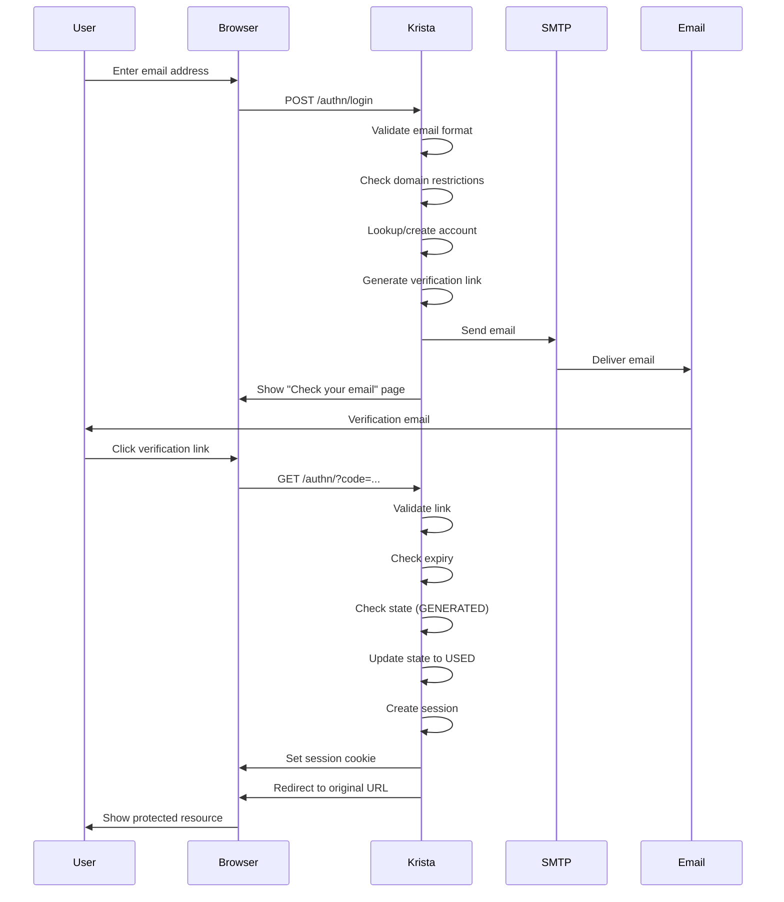

# Authentication

## Overview

The Email Authentication Extension provides email-based authentication through email verification links. Users authenticate by entering their email address and clicking a verification link sent to their inbox. This eliminates the need for users to remember passwords while maintaining robust security through time-limited, one-time use verification codes.

**Note**: While users don't need passwords, the extension requires SMTP server credentials (sender account and password) to be configured by administrators to send verification emails.

## Authentication Flow

The authentication process follows a secure, multi-step flow:

### Step 1: User Initiates Login

1. User navigates to a protected resource or login page
2. System redirects to `/authn/login` if not authenticated
3. User sees login page with email input field
4. User enters their email address
5. User clicks "Send Login Link" button

### Step 2: Email Validation

The system validates the email address:

1. **Format Validation**: Checks email format using regex pattern
   - Pattern: `^[a-z0-9_+&*-]+(?:\.[a-z0-9_+&*-]+)*@(?:[a-z0-9-]+\.)+[a-z]{2,7}$`
   - Email is normalized (lowercased and trimmed)

2. **Domain Validation**: Checks if email domain is allowed
   - Workspace-level domain restrictions are checked first
   - Invoker-level "Supported Domains" provide additional filtering
   - Both levels must allow the domain

3. **Account Lookup**: Checks if account exists
   - If account exists: Proceeds to send verification link
   - If account doesn't exist: Checks "Allow New Account Creation" setting

### Step 3: Account Provisioning (If Needed)

If the account doesn't exist and "Allow New Account Creation" is enabled:

1. **Domain Check**: Verifies email domain is in allowed list
2. **Role Provisioning**: Creates or retrieves default role
3. **Account Creation**: Creates new account with:
   - Email address as account identifier
   - Specified default roles
   - Account status set to active
4. **Workspace Integration**: Account is added to workspace

If "Allow New Account Creation" is disabled and account doesn't exist:
- Error is returned: "Account not found"
- User cannot proceed with authentication

### Step 4: Verification Link Generation

The system generates a secure verification link:

1. **Session Creation**: Creates a new session ID
2. **Secret Generation**: Generates a unique UUID as secret code
3. **Expiry Calculation**: Sets expiry time to 30 minutes from now
4. **Link Storage**: Stores verification details:
   - Email address
   - Secret code
   - Expiry timestamp
   - Session ID
   - Account ID
   - State: GENERATED

5. **Link Construction**: Builds verification URL:
   ```
   https://[appliance-url]/authn/?code=[secret]&X-Krista-Original-URI=[original-url]
   ```

### Step 5: Email Delivery

The system sends the verification email:

1. **SMTP Configuration**: Retrieves SMTP settings from invoker attributes
2. **Email Composition**: Creates email with:
   - Subject: "Email Authentication Link"
   - Body: Contains clickable verification link
   - Sender: Configured "Email Address of Sender"

3. **SMTP Connection**: Establishes secure connection:
   - Protocol: SSL/TLS
   - Port: Configured SMTP port (typically 465 or 587)
   - Authentication: Uses configured SMTP credentials

4. **Email Transmission**: Sends email to user's address
5. **Waiting Page**: User is redirected to waiting page showing:
   - "Check your email" message
   - Instructions to click the link
   - Session ID in cookie

### Step 6: Link Verification

When user clicks the verification link:

1. **Link Retrieval**: System retrieves verification details using secret code
2. **Validation Checks**:
   - ✅ Link exists in storage
   - ✅ Link hasn't expired (within 30-minute window)
   - ✅ Link state is GENERATED (not already USED)
   - ✅ Secret code matches stored value

3. **Domain Validation**: Re-validates email domain against:
   - Workspace supported domains
   - Invoker supported domains
   - "Allow New Account Creation" setting

4. **State Update**: Updates link state to USED
5. **Session Creation**: Creates authenticated session for account

### Step 7: Session Establishment

The system establishes an authenticated session:

1. **Session ID Generation**: Creates new session ID
2. **Session Storage**: Maps session ID to account ID
3. **Cookie Creation**: Sets secure HTTP-only cookie:
   - Name: `X-Krista-Session-Id`
   - Value: Session ID
   - Attributes: HttpOnly, Secure
   - Path: `/`

4. **Redirect**: Redirects user to original requested URL
5. **Authentication Complete**: User is now authenticated

## Session Management

### Session Creation

Sessions are created after successful link verification:

- **Session ID**: Unique identifier (UUID)
- **Account Mapping**: Session ID mapped to account ID
- **Storage**: Stored in session manager
- **Cookie**: Sent to browser as HTTP-only cookie

### Session Validation

On subsequent requests:

1. System reads `X-Krista-Session-Id` cookie from request
2. Looks up account ID using session ID
3. If found: Request is authenticated
4. If not found: User must re-authenticate

### Session Termination

Sessions can be terminated by:

1. **Explicit Logout**: User calls `/authn/logout` endpoint
2. **Session Expiry**: Session expires after inactivity period
3. **Manual Removal**: Administrator removes session

## Security Features

### Time-Limited Verification Links

- **Expiry Time**: 30 minutes from generation
- **Calculation**: `System.currentTimeMillis() + (30 * 60 * 1000)`
- **Enforcement**: Links are rejected if current time > expiry time
- **Cleanup**: Expired links are removed from storage

### One-Time Use Links

- **State Tracking**: Each link has a state (GENERATED, USED)
- **Initial State**: GENERATED when link is created
- **Verification**: Only GENERATED links can be used
- **State Change**: State changes to USED after successful verification
- **Rejection**: USED links are rejected with error message

### Secret Code Security

- **Generation**: UUID.randomUUID() provides cryptographically strong random values
- **Uniqueness**: Each link has a unique secret code
- **Validation**: Secret must match exactly (case-sensitive)
- **Storage**: Secrets are stored securely in session manager

### Domain Restrictions

The extension enforces domain restrictions at two levels:

#### Workspace-Level Domains

- Configured in workspace settings
- Applied to all authentication methods
- Checked first during validation
- If workspace has domain restrictions, email domain must match

#### Invoker-Level Domains

- Configured in "Supported Domains" parameter
- Specific to Email Authentication Extension
- Provides additional filtering beyond workspace restrictions
- Both workspace and invoker domains must allow the email domain

#### Domain Validation Logic

```
if (workspace has domain restrictions) {
    if (email domain not in workspace domains) {
        reject authentication
    }
}

if (invoker has supported domains) {
    if (email domain not in invoker domains) {
        reject authentication
    }
}

proceed with authentication
```

### Account Provisioning Security

When "Allow New Account Creation" is enabled:

1. **Domain Validation**: Email domain must be in allowed list
2. **Role Assignment**: Only configured default roles are assigned
3. **Account Status**: New accounts are active by default
4. **Workspace Membership**: Accounts are added to current workspace only

When "Allow New Account Creation" is disabled:

1. **Existing Accounts Only**: Only users with existing accounts can authenticate
2. **No Auto-Provisioning**: New users receive "Account not found" error
3. **Manual Creation**: Accounts must be created manually by administrators

### Email Security

- **SMTP Encryption**: SSL/TLS encryption for SMTP connections
- **Credential Protection**: SMTP passwords are encrypted in storage
- **Sender Validation**: Sender email address is validated
- **Link Obfuscation**: Verification links use random UUIDs

### Session Security

- **HTTP-Only Cookies**: Session cookies are not accessible via JavaScript
- **Secure Flag**: Cookies are only sent over HTTPS
- **Session Isolation**: Each session is isolated to a specific account
- **Session Expiry**: Sessions expire after inactivity

## Error Handling

### Common Authentication Errors

| Error | Cause | Resolution |
|-------|-------|------------|
| "Invalid email format" | Email doesn't match regex pattern | Enter valid email address |
| "Domain not supported" | Email domain not in allowed list | Contact administrator to add domain |
| "Account not found" | Account doesn't exist and auto-creation disabled | Contact administrator to create account |
| "Link expired" | Verification link older than 30 minutes | Request new verification link |
| "Link already used" | Verification link already used | Request new verification link |
| "Invalid verification code" | Secret code doesn't match | Request new verification link |
| "SMTP configuration error" | SMTP settings incorrect | Contact administrator to fix configuration |
| "Email delivery failed" | SMTP server unreachable or credentials invalid | Contact administrator to check SMTP settings |

### Error Messages

The extension provides user-friendly error messages:

- **Email Validation Errors**: "Please enter a valid email address"
- **Domain Errors**: "Your email domain is not supported. Please contact your administrator."
- **Account Errors**: "Account not found. Please contact your administrator."
- **Link Errors**: "This verification link has expired or is invalid. Please request a new one."
- **SMTP Errors**: "Unable to send verification email. Please try again later."

## Best Practices

### For Users

1. **Check Spam Folder**: Verification emails may be filtered as spam
2. **Use Link Quickly**: Links expire after 30 minutes
3. **Don't Share Links**: Verification links are single-use and personal
4. **Request New Link**: If link expires, request a new one
5. **Logout When Done**: Explicitly logout when finished

### For Administrators

1. **Configure SMTP Properly**: Test SMTP settings before deployment
2. **Use SSL/TLS**: Always use encrypted SMTP connections
3. **Set Domain Restrictions**: Limit authentication to trusted domains
4. **Review Default Roles**: Ensure default roles have appropriate permissions
5. **Monitor Authentication**: Review authentication logs regularly
6. **Disable Auto-Creation**: Consider disabling auto-creation for sensitive environments
7. **Use App Passwords**: For Gmail, use App Passwords instead of account passwords

### For Developers

1. **Handle Errors Gracefully**: Provide clear error messages to users
2. **Validate Inputs**: Always validate email addresses before processing
3. **Check Session State**: Verify session is valid before granting access
4. **Log Authentication Events**: Log all authentication attempts for auditing
5. **Test Edge Cases**: Test expired links, used links, invalid domains, etc.

## Sequence Diagram



## See Also

- [Extension Configuration](pages/ExtensionConfiguration.md) - Configure SMTP and domain settings
- [API Endpoints](pages/APIEndpoints.md) - REST API documentation
- [Dependencies](pages/Dependencies.md) - Using as a dependency
- [Troubleshooting](pages/Troubleshooting.md) - Common issues and solutions


